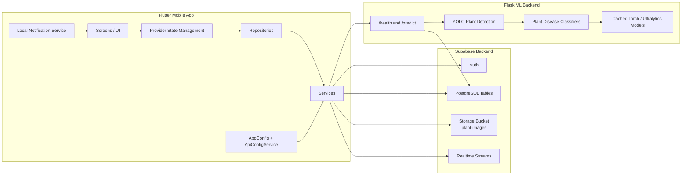

# Gardan Architecture

## Overview

Gardan is organized as a layered mobile application with a separate machine-learning backend:

- Flutter app for the user interface and local state
- Repository and service layers for backend communication
- Supabase for authentication, database, storage, and realtime updates
- Flask inference API for plant detection and disease classification
- Local notifications for watering reminders

## Architecture Diagram

## Component Responsibilities

### Flutter Frontend

- Renders onboarding, authentication, home, scan, plants, shop, cart, checkout, profile, and order tracking screens.
- Uses `GoRouter` for navigation and nested shell routing.
- Uses `Provider` for application state.
- Delegates persistence and external calls to repositories and services instead of calling backends directly.

### State Management

- `AuthProvider` manages login and session status.
- `PlantsProvider` manages plant CRUD and watering updates.
- `ScansProvider` manages image scan requests and saved scan history.
- `ProductsProvider`, `CartProvider`, and `OrdersProvider` support the shop and checkout flow.
- `RemindersProvider` manages watering reminder data.

### Repository Layer

- Repositories coordinate business operations and error handling.
- `ScansRepository` sends an image to the Flask API, then saves the returned result in Supabase.
- `OrderRepository` creates orders and order items.
- `PlantsRepository` wraps plant CRUD and watering actions.
- `ProductsRepository` reads product catalog data.

### Service Layer

- Services contain the actual data-access logic.
- `SupabaseService` exposes the active Supabase client and current user.
- `PlantsService`, `ScansService`, `ProductsService`, and `OrderService` perform table operations.
- `StorageService` uploads and deletes plant images in Supabase Storage.
- `FlaskApiService` sends multipart image uploads to the ML backend.

### Supabase Backend

- `Auth` handles user sign-up, sign-in, and session management.
- PostgreSQL tables store plants, scans, products, orders, and order items.
- Storage holds uploaded plant images in the `plant-images` bucket.
- Realtime streams support live order tracking.

### Flask Machine-Learning Backend

- Exposes `GET /health` for readiness checks and `POST /predict` for inference.
- Uses YOLO to detect the plant region in the uploaded image.
- Uses a plant-specific disease classifier to identify the disease class.
- Preloads and caches models at startup to reduce request latency.
- Returns structured detection results that the Flutter app converts into a `Scan` record.

### Local Services

- `NotificationService` schedules watering reminders on the device.
- `ApiConfigService` stores the selected Flask host locally.
- `AppConfig` resolves the ML API base URL for the current platform.

## Communication Flow

### 1. App Startup

1. Flutter initializes bindings.
2. Supabase is initialized.
3. Local notifications and API config are initialized.
4. The app checks whether this is the first launch and whether the user is already logged in.
5. Routing starts at onboarding, login, or home.

### 2. Plant Management

1. UI sends an action to `PlantsProvider`.
2. The provider calls `PlantsRepository`.
3. The repository delegates to `PlantsService`.
4. `PlantsService` reads or writes the `plants` table in Supabase.
5. If a plant image changes, `StorageService` uploads the new image first.

### 3. Disease Scan Flow

1. The user captures or selects a plant image.
2. `ScansProvider` calls `ScansRepository`.
3. `ScansRepository` sends the file to `FlaskApiService`.
4. The Flask API runs YOLO detection and disease classification.
5. The API returns the plant type, bounding box, disease name, and confidence.
6. The repository saves the scan through `ScansService` into Supabase.
7. The UI displays the diagnosis and treatment suggestion.

### 4. Shop and Order Flow

1. UI loads products through `ProductsProvider`.
2. `ProductsRepository` reads the `products` table through `ProductsService`.
3. The user adds items to the cart.
4. `OrderRepository` calls `OrderService` to create an order.
5. `OrderService` inserts rows into `orders` and `order_items`.
6. Order tracking uses Supabase realtime updates.

### 5. Reminder Flow

1. `RemindersProvider` stores reminder settings.
2. `NotificationService` schedules a local notification on the device.
3. The reminder fires without needing a server round trip.

## Data Stores

- `plants` stores user plants and care metadata.
- `scans` stores analysis results and links them to plants.
- `products` stores shop catalog items.
- `orders` stores order headers and delivery information.
- `order_items` stores the line items for each order.
- `plant-images` stores uploaded plant photos.

## Why This Structure Works

- The Flutter app stays thin because it delegates data access and ML calls to service layers.
- Supabase centralizes authentication and persistence without requiring a custom CRUD backend.
- The Flask service isolates the heavy ML workload from the mobile app.
- The architecture supports offline-friendly UI state, realtime order tracking, and scalable model updates.
